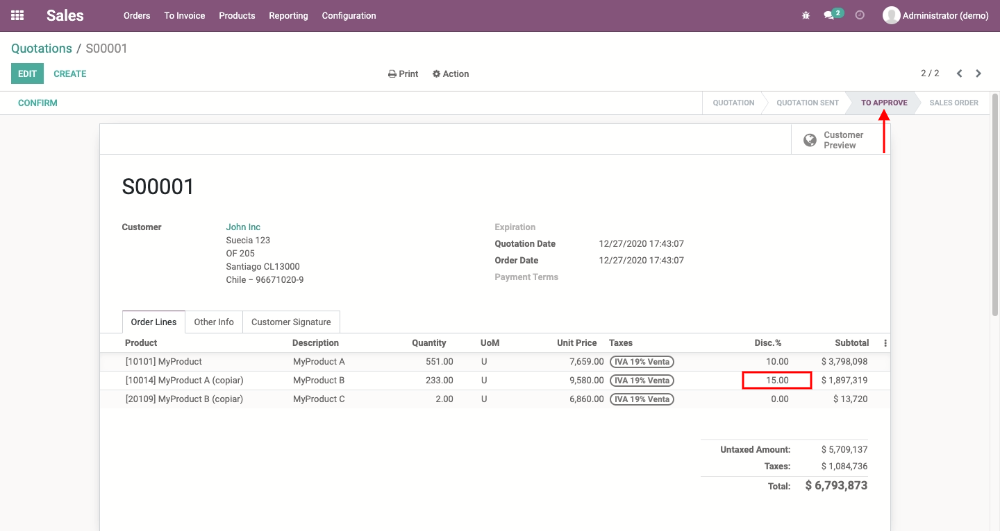

# Sale Discount Approval
Managers must approve discounts granted on sales order lines.

## Table of contents
* [Configuration](#configuration)
* [Usage](#usage)
* [Credits](#credits)
  * [Authors](#authors)
  * [Contributors](#contributors)
  * [Maintainers](#maintainers)

## Configuration
Go to *Sales > Configuration > Settings* and under the Pricing section enable
Discounts and Approval of Discounts options.

Go to *Settings > Users & Companies > Users* and enable the users responsible
for approving sales orders.

## Usage
From now on, when a discount on sale lines exceeds the maximum value allowed
it should be approved by an authorized user.

## Credits

### Authors
* Konos Soluciones & Servicios

### Contributors
* Alexander Olivares <<aolivares@konos.cl>>

### Maintainers
This module is maintained by **Konos Soluciones & Servicios**.

Current maintainer:
* Alexander Olivares <<aolivares@konos.cl>>
