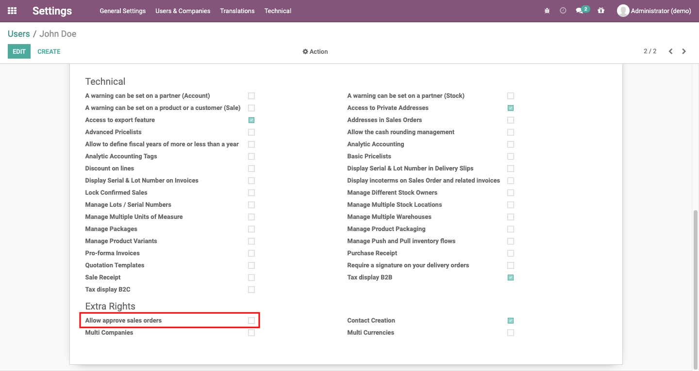
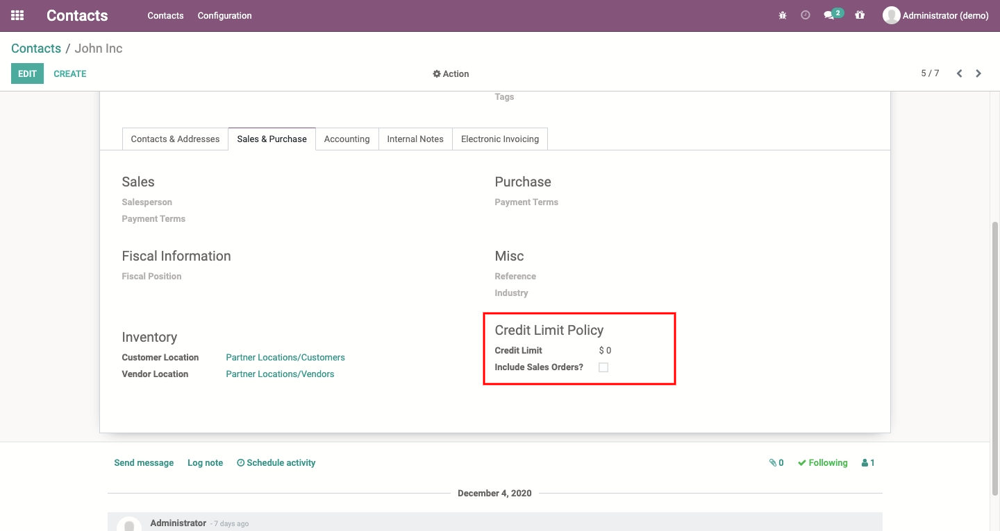
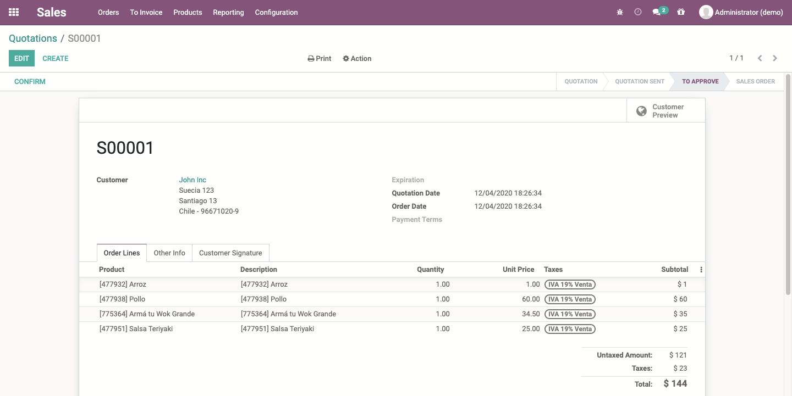

# Sale Order Approval
Managers must approve sales orders depending on the partner credit limit.

## Table of contents
* [Configuration](#configuration)
* [Usage](#usage)
* [Known issues](#known_issues)
* [Credits](#credits)
  * [Authors](#authors)
  * [Contributors](#contributors)
  * [Maintainers](#maintainers)

## Configuration
Go to *Settings > Users & Companies > Users* and enable the users responsible
for approving sales orders.

Set the desired credit limit policy for the partner.

## Usage
From now on, when a sale order exceeds the available partner credit limit it
should be approved by an authorized user.

## Known issues
This feature will not work on non-enterprise clients as it depends on the
`account_followup` module and it's not available for the community version.

## Credits

### Authors
* Konos Soluciones & Servicios

### Contributors
* Alexander Olivares <<aolivares@konos.cl>>

### Maintainers
This module is maintained by **Konos Soluciones & Servicios**.

Current maintainer:
* Alexander Olivares <<aolivares@konos.cl>>
